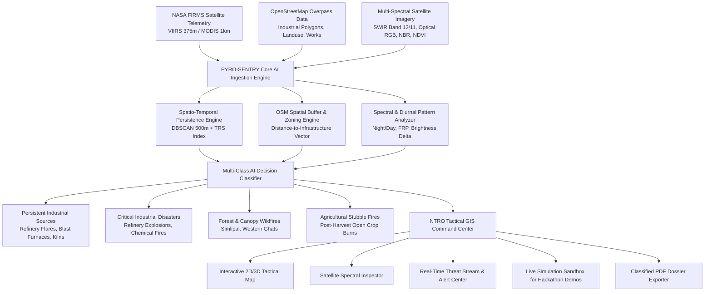

# 🛰️ PYRO-SENTRY NTRO
### AI-Based Detection & Classification of Industrial Fires and Persistent Thermal Sources
**Smart India Hackathon (SIH) Problem Statement**: `SIH26162`  
**Organization**: National Technical Research Organisation (NTRO)  
**Category**: Software | **Theme**: Miscellaneous / Defense & Geospatial Intelligence  
**Core Technologies**: AI/ML, Computer Vision, GIS, Remote Sensing, Satellite Data (NASA FIRMS & Sentinel-2 MSI), OpenStreetMap (OSM)

---

## 📌 Executive Summary
In defense, intelligence, and national disaster monitoring, standard satellite infrared sensors (such as NASA FIRMS VIIRS & MODIS) detect thermal anomalies indiscriminately. These detections conflate continuous, authorized **industrial baseline emitters** (refinery flare stacks, blast furnaces, brick kilns, thermal power exhausts) with **critical industrial disasters** (refinery explosions, chemical plant thermal runaways) and **forest canopy wildfires / agricultural burning**.

**PYRO-SENTRY NTRO** is an intelligence-grade Geospatial Intelligence (GEOINT) and Computer Vision platform designed specifically for NTRO. It autonomously classifies and isolates industrial persistent sources from natural and disaster fires using spatio-temporal persistence modeling, OSM infrastructure proximity, and Sentinel-2 multi-spectral satellite indices.

---

## 🌟 Core Features

1. **Tactical Military GIS Command Center**:
   - Leaflet + Canvas Heatmap + Dark Cyber GEOINT theme.
   - Interactive thermal markers with animated pulsating radar rings color-coded by classification.
   - OSM Industrial polygon boundary overlays with active plant metadata.
   - Atmospheric smoke plume dispersion cone projection with wind vector & AQI modeling.
   - Base map switcher: Tactical Dark, High-Resolution Satellite (Esri/Maxar), and Topo Terrain.

2. **Multi-Factor AI & Spatio-Temporal Classifier**:
   - **Spatio-Temporal Persistence Index ($P_{idx}$)**: DBSCAN spatial clustering ($500\,\text{m}$ radius) + 90-day orbital pass recurrence score (TRS) to isolate baseline industrial flaring.
   - **OpenStreetMap (OSM) Spatial Proximity Engine**: Computes exact distances and containment within tagged hazardous facilities (`man_made=works`, `landuse=industrial`, `power=plant`).
   - **Multi-Spectral Satellite Vision Engine**: Analyzes Sentinel-2 SWIR Band 12/11, Normalized Burn Ratio ($\text{NBR}$), and Vegetation Index ($\text{NDVI}$) to differentiate metallic industrial roofs from canopy burn scars.
   - **Diurnal Signature Filter**: Evaluates 24-hour day/night thermal curves (industrial flares burn steadily at night; crop burning peaks in afternoon).

3. **Interactive AI Simulation Sandbox (Judge Evaluation Suite)**:
   - Live test-bench for hackathon evaluations.
   - Pre-loaded scenarios: *Jamnagar Petrochemical Explosion*, *Simlipal Forest Canopy Firestorm*, *SAIL Bhilai Steel Blast Furnace Baseline*, and *Punjab Stubble Surge*.
   - Live parameter sliders (FRP in MW, Brightness in Kelvin, 90-day recurrence count, OSM proximity distance, Wind speed/direction).
   - 1-Click live injection into the active satellite telemetry stream!

4. **Deep-Dive Hotspot Inspector**:
   - Dual satellite spectral viewer (Sentinel-2 SWIR false color composite vs True Color RGB).
   - Explainable AI (XAI) feature attribution breakdown chart.
   - Radiative power gauge & temperature delta metrics.
   - **1-Click Classified PDF Intelligence Dossier Exporter** (`jsPDF`).

5. **Real-Time Threat Stream & Audio Alarm Dispatch**:
   - Priority-based threat stream with CRITICAL/HIGH severity filters.
   - Synthesized Web Audio tactical acoustic alert.
   - 1-Click automated NDRF / HazMat / Drone Intervention Dispatch.

---

## 🏗️ Architecture & AI Classification Pipeline



---

## 💻 Tech Stack

- **Frontend**: React 18, TypeScript, Tailwind CSS, Lucide Icons, Vite
- **Geospatial & Mapping**: Leaflet, Esri World Imagery, OpenTopoMap, CartoDB Dark Matter
- **Charts & Data Visualization**: Recharts (Donut charts, Area diurnal profiles, FRP distributions)
- **AI & Analytics Algorithms**: Client-Side DBSCAN Great-Circle Clustering, Spectral Index Processor (SWIR/NBR/NDVI), Multi-Factor Decision Tree Classifier
- **Data Integrations**: NASA EOSDIS FIRMS API (VIIRS/MODIS), OpenStreetMap Overpass API
- **Document Generation**: jsPDF Intelligence Dossier Exporter

---

## 🚀 Quick Start Guide

### Prerequisites
- Node.js (v18 or higher)
- npm (v9 or higher)

### Installation
```bash
# 1. Clone the repository
git clone https://github.com/<YOUR_USERNAME>/<YOUR_REPO_NAME>.git
cd pyro-sentry-ntro

# 2. Install dependencies
npm install

# 3. Start the development server
npm run dev
```

The application will be running at `http://localhost:3000`.

### Production Build
```bash
npm run build
npm run preview
```

---

## 🛰️ NASA FIRMS API Key Setup (Optional)
1. Get a free NASA FIRMS `MAP_KEY` from [https://firms.modaps.eosdis.nasa.gov/api/map_key](https://firms.modaps.eosdis.nasa.gov/api/map_key).
2. Click **NASA API KEY** in the top navigation bar of the application and paste your key.
3. If no key is entered, the platform automatically feeds high-resolution simulated telemetry across India's strategic industrial & forestry corridors.

---

## 👥 Hackathon Team & Attribution
- **Problem Statement**: SIH26162
- **Organization**: National Technical Research Organisation (NTRO)
- **Developed for**: Smart India Hackathon (SIH)
- **License**: MIT
